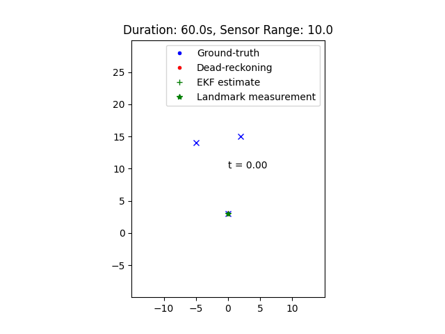

# ekf_slam_pr
Batch-mode EKF SLAM demo, (more-or-less) following the notation and flow of Ch. 7.4 from Probabilistic Robotics, 
by Thrun et al. (referred-to as "PR" below).

Simulates a robotic sensor platform with a range/bearing sensor, and an odometer, moving in a 2D planar environment 
containing three landmarks.  
The range/bearing and odometry sensor measurements are noisy, and we simulate this with additive Gaussian noise. 
The simulation is represented graphically by the animation below.

### Highlights:
* The blue 'X' markers are the _true_ positions of our landmarks.
* The blue trail shows the _true_ trajectory of the platform. Our simulated platform moves at a constant velocity, 
in a circular arc, according to a very simple velocity motion model (eq. 5.13 in PR, but with noise removed). 
Noisy simulated measurements (range/bearing, odometry) are generated from this perfectly-circular arc.
* The red trail represents a typical "dead-reckoning" estimate of the robot positions, one that might be derived from 
noisy odometry measurements alone, without use of the landmark sensor.
* The green trail represents the EKF-estimated trajectory, derived from a combination of odometry and landmark observations.
* Green asterisks near the blue 'X' markers represent noisy measurements of in-range landmarks, re-projected into the map.
the landmarks are, based on measurements
* The red ellipses represent 3-sigma covariance estimates associated with the platform, and the landmarks.



### Of note:
* The robot's initial position is known precisely at the start, with one landmark in-range. The error ellipses of the 
robot and the landmark are too small to see. Since we have a landmark in-range, our location error remains low as we move.
* As soon as the first landmark is out-of-range, the robot must rely on odometry alone, and so the location uncertainty 
grows at a constant rate.
* Once another landmark is acquired, the location uncertainty stops growing.
* When the robot re-acquires the _first_ landmark, the lower uncertainty associated with our well-known start position 
propagates to the robot and the other in-range landmark. This is known as "loop closure" in context of SLAM.
* Shortcut #1: the red dead-reckoning trajectory is pre-generated from the ground truth (also pre-generated). It's _not_ 
generated from the simulated noise values we used in the prediction step. Originally, I did it that way, but it just 
cluttered-up the code.
* Shortcut #2: the number of landmarks is known at the start. EKF SLAM can accommodate an arbitrary number of landmarks, 
adding them on-the-fly, but requires additional landmark management machinery. For demonstration/learning purposes, it 
was easier to use a fixed-size state vector.
* Shortcut #3: no attempt was made at efficiency. The goal was to emulate the algorithm as described in PR Table 10.1. 
There are numerous opportunities for speed gains. 

### Give it a Spin
Tested on Python 3.10, 3.12.
```angular2html
git clone (this repo)
cd ekf_slam_pr
python3 -m venv .venv
. .venv/bin/activate
pip install -r requirements.txt
sudo apt install libxcb-cursor-dev
pip install -e .
python3 main.py
```

[Resources and Notes](doc/resources_and_notes.md): assorted info and notes compiled while working on this.
